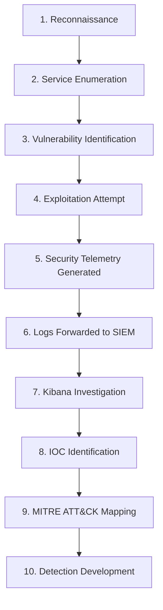
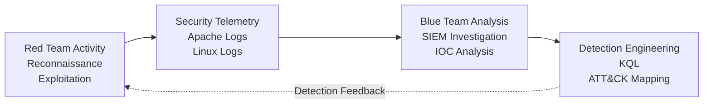

# Architecture Diagram

```mermaid
flowchart LR

    subgraph AWS["AWS Environment"]

        subgraph RED["Attacker"]
            KALI["Kali Linux<br/>Nmap • curl"]
        end

        subgraph TARGET["Target"]
            UBUNTU["Ubuntu Linux"]
            APACHE["Apache HTTP Server"]
        end

        subgraph DEFENDER["Defender / SIEM"]
            RSYSLOG["rsyslog<br/>Log Collection"]
            LOGSTASH["Logstash<br/>Log Processing"]
            ELASTIC["Elasticsearch<br/>Indexing & Storage"]
            KIBANA["Kibana<br/>SIEM Analysis"]
        end

    end

    KALI -->|"Reconnaissance<br/>Nmap"| APACHE
    KALI -->|"HTTP Exploitation<br/>CVE Testing"| APACHE

    APACHE --> UBUNTU

    UBUNTU -->|"System / Apache Logs"| RSYSLOG
    RSYSLOG -->|"Forwarded Events"| LOGSTASH
    LOGSTASH -->|"Processed Events"| ELASTIC
    ELASTIC -->|"Searchable Events"| KIBANA

    KIBANA --> ANALYSIS["IOC Analysis<br/>KQL Investigation<br/>MITRE ATT&CK Mapping<br/>Detection Engineering"]
```

# Attack-to-Detection Workflow

```mermaid
flowchart TD

    A["1. Reconnaissance"]
    B["2. Service Enumeration"]
    C["3. Vulnerability Identification"]
    D["4. Exploitation Attempt"]
    E["5. Security Telemetry Generated"]
    F["6. Logs Forwarded to SIEM"]
    G["7. Kibana Investigation"]
    H["8. IOC Identification"]
    I["9. MITRE ATT&CK Mapping"]
    J["10. Detection Development"]

    A --> B
    B --> C
    C --> D
    D --> E
    E --> F
    F --> G
    G --> H
    H --> I
    I --> J
```

# Purple Team Model

```mermaid
flowchart LR

    RED["Red Team Activity<br/>Reconnaissance<br/>Exploitation"]

    TELEMETRY["Security Telemetry<br/>Apache Logs<br/>Linux Logs"]

    BLUE["Blue Team Analysis<br/>SIEM Investigation<br/>IOC Analysis"]

    DETECTION["Detection Engineering<br/>KQL<br/>ATT&CK Mapping"]

    RED --> TELEMETRY
    TELEMETRY --> BLUE
    BLUE --> DETECTION

    DETECTION -. "Detection Feedback" .-> RED
```
