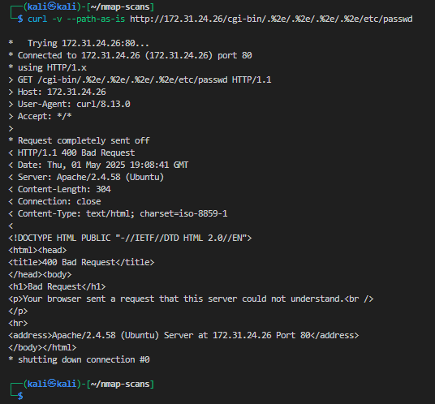
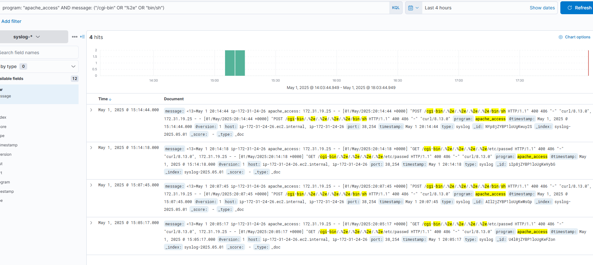
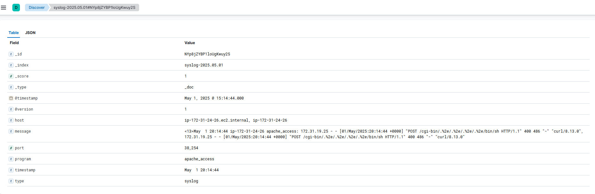
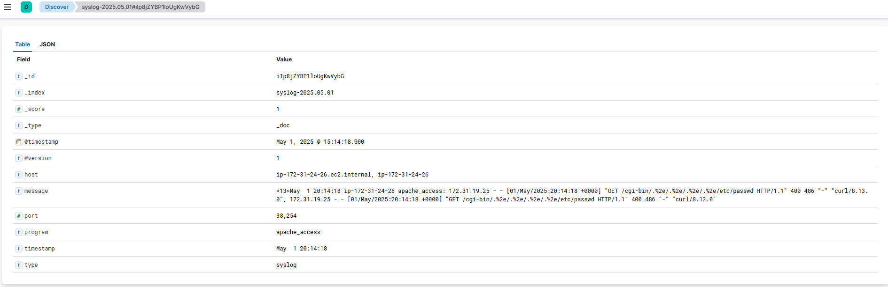

# Completed Engagement Record

## Project Scope

This record summarizes the completed CSEC 5350 Purple Team exercise without publishing personal identifiers, cloud account details, credentials, or live infrastructure addresses.

## Environment

| Role | Platform | Function |
| --- | --- | --- |
| Attacker | Kali Linux on AWS EC2 | Nmap reconnaissance and controlled HTTP requests |
| Target / log source | Ubuntu on AWS EC2 | Apache 2.4.58, rsyslog, and auditd |
| Defender / SIEM | Ubuntu on AWS EC2 | Elasticsearch, Logstash, and Kibana |

AWS security groups limited traffic to required administrative, web, syslog, Elasticsearch, and Kibana flows during the authorized exercise.

## Build Validation

The following capabilities were configured and validated:

- Kali tooling installed for reconnaissance and HTTP testing.
- Apache installed and enabled on the Ubuntu target.
- rsyslog and auditd enabled on the log source.
- Elasticsearch configured as a single-node deployment.
- Kibana enabled for event discovery and analysis.
- Logstash configured for syslog ingestion.
- Test messages generated on Ubuntu and confirmed in Kibana.

## Red Team Activity

### Reconnaissance

A SYN and service-version scan was run against the controlled target:

```bash
nmap -sS -sV -T4 -Pn <TARGET-IP> -oN nmap_scan_target.txt
```

The scan identified Apache HTTP Server 2.4.58 on TCP port 80. The SIEM server did not expose an intended attack surface.

### Vulnerability Selection

Two historical Apache vulnerabilities were selected to model recognizable path-traversal and RCE-oriented request patterns:

- CVE-2021-41773, affecting Apache HTTP Server 2.4.49 under applicable configurations
- CVE-2021-42013, affecting Apache HTTP Server 2.4.50 under applicable configurations

The actual target used Apache 2.4.58 and was not expected to be vulnerable.

### Controlled Tests

Sanitized examples of the request shapes are shown below:

```bash
curl -v --path-as-is "http://<TARGET-IP>/cgi-bin/.%2e/.%2e/.%2e/.%2e/etc/passwd"
```

```bash
curl -v --path-as-is -d '<BENIGN-COMMAND>'   "http://<TARGET-IP>/cgi-bin/.%2e/.%2e/.%2e/.%2e/bin/sh"
```

Both requests were rejected. No unauthorized access, shell execution, persistence, privilege escalation, or target compromise occurred.

## Proof of Outcomes

### CVE-2021-42013-style request rejected

The patched Apache target rejected the RCE-oriented POST request.


### CVE-2021-41773-style request rejected

The patched Apache target rejected the encoded path-traversal GET request.



### POST activity detected in Kibana

The SIEM recorded the encoded `/cgi-bin` POST request generated during the controlled test.



### GET activity detected in Kibana

The SIEM recorded the encoded request associated with the path-traversal simulation.



### Event evidence detail

The expanded Kibana record provides supporting request and response context for the investigation.



## Blue Team Findings

Apache request telemetry was forwarded to the ELK Stack and investigated in Kibana. The encoded traversal patterns were observable in both GET and POST events.

Confirmed evidence included:

- `/cgi-bin` request paths
- encoded `%2e` traversal sequences
- sensitive path and shell strings
- GET and POST HTTP methods
- a command-line HTTP client user agent
- HTTP 400 responses
- timestamps that supported chronological reconstruction

## Detection Timeline

| Time (UTC) | Event | Result |
| --- | --- | --- |
| 2025-05-01 20:14:18 | CVE-2021-41773-style GET request | Rejected and logged |
| 2025-05-01 20:14:44 | CVE-2021-42013-style POST request | Rejected and logged |

## Analysis

The strongest signals were the encoded URI structure, sensitive path strings, uncommon command-line client behavior, and close timing between related requests. HTTP 400 responses showed that the server rejected the traffic, but response status alone did not make the request benign.

The exercise supports a layered detection strategy:

1. Match high-confidence request characteristics.
2. Aggregate repeated activity by source and time window.
3. Correlate scanning with later suspicious web requests.
4. distinguish attempted exploitation from confirmed execution.
5. Validate detection logic against normal web traffic.

## Outcome

The project met its central Purple Team objective: controlled attacker activity produced evidence that was collected, found, correlated, and translated into defensive recommendations. The lab also demonstrated why reporting must separate a successful detection from a successful compromise.
