# AWS Environment Build

## Purpose

This document records how the completed CSEC 5350 Purple Team environment was built in AWS. The environment separated offensive activity, the target/log source, and defensive analysis across three EC2 instances.

> **Historical build record:** These screenshots and commands document the Spring 2025 implementation. They are not a current production-hardening guide. Public IP addresses, private IP addresses, security-group details, and other original lab identifiers remain visible with the repository owner's explicit approval.

## Architecture

| Role | Host | Primary function |
| --- | --- | --- |
| Red Team | Kali Linux EC2 | Reconnaissance and controlled HTTP testing |
| Target / log source | Ubuntu EC2 | Apache, rsyslog, auditd, and event forwarding |
| Blue Team / SIEM | Ubuntu EC2 | Elasticsearch, Logstash, Kibana, and investigation |

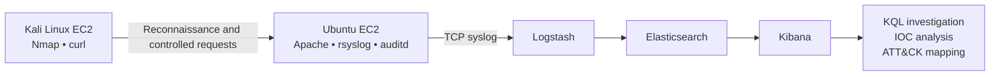

## Phase 1 — Kali Linux Attacker

### 1. Provision the EC2 instance

A Kali Linux EC2 instance was created as the dedicated Red Team system.

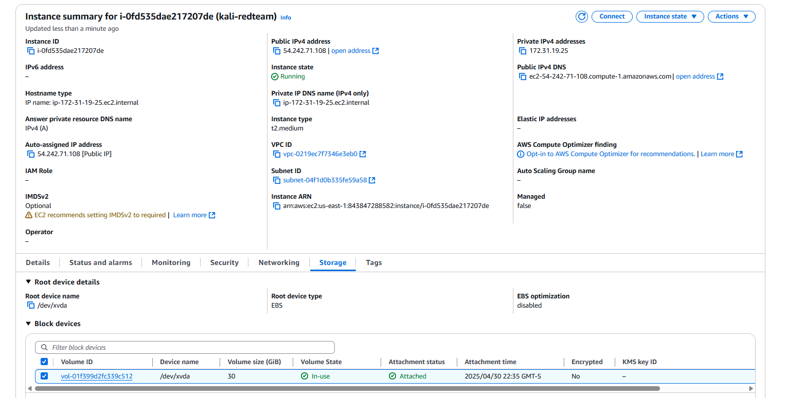

### 2. Configure network access

The lab security group was configured for the traffic required by the exercise, including administration, web testing, syslog, and Kibana access.

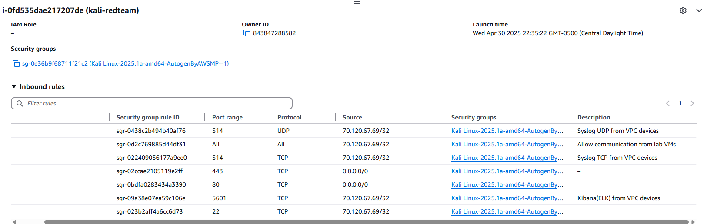

For production, access should be restricted to approved source addresses and management interfaces should not be publicly exposed.

### 3. Install the testing tools

The Kali system was updated and equipped with the tools needed for reconnaissance and controlled testing:

```bash
sudo apt update
sudo apt upgrade -y
sudo apt install -y nmap net-tools curl git python3-pip
```

Additional security tooling was installed for the broader course environment, although the completed scenario primarily used Nmap and curl.

### 4. Validate connectivity

Connectivity tests confirmed communication between the attacker and the other authorized lab systems.

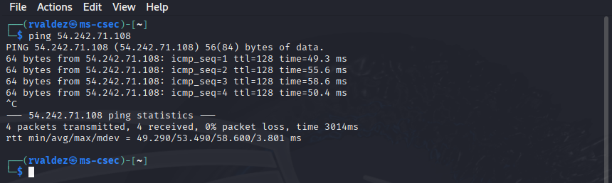

## Phase 2 — Ubuntu Target and Log Source

### 1. Provision the Ubuntu instance

A separate Ubuntu EC2 instance was created to serve as the controlled target and supplemental logging source.

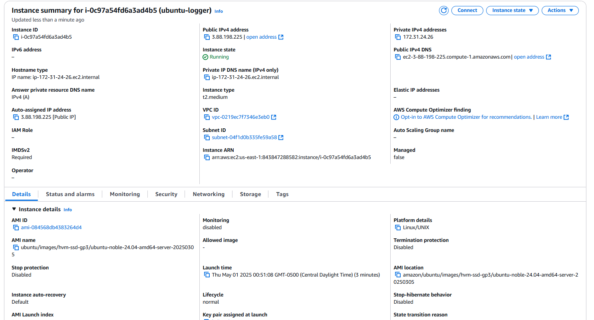

### 2. Install logging services

rsyslog provided system-log collection and forwarding. auditd was enabled to support system-level auditing.

```bash
sudo apt update
sudo apt upgrade -y
sudo apt install -y rsyslog auditd

sudo systemctl enable --now rsyslog
sudo systemctl enable --now auditd
```

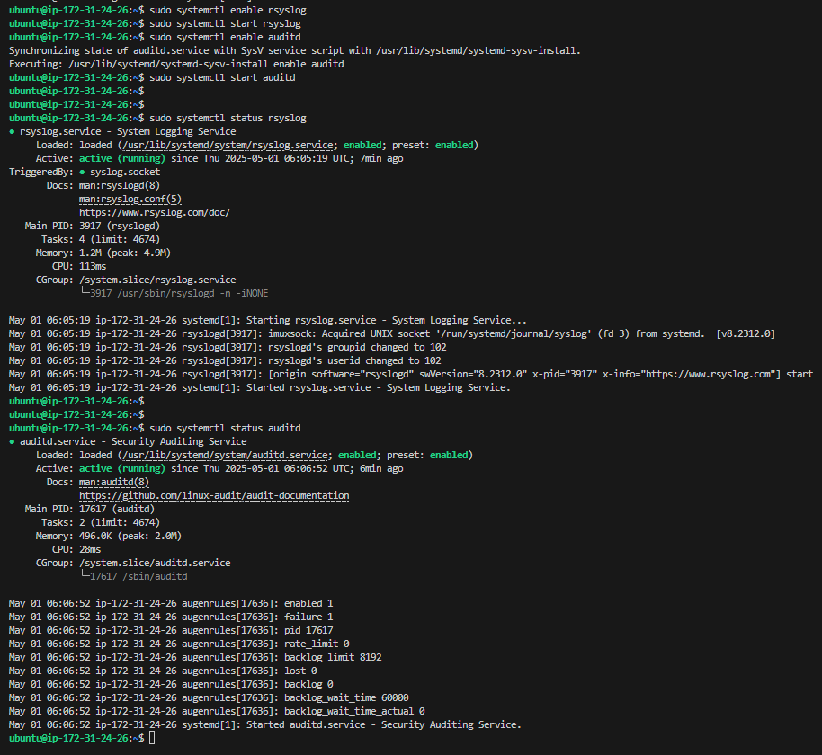

### 3. Generate a validation event

A known test event was generated before attack simulation to prove the local collection path worked:

```bash
logger "This is a test log from ubuntu-logger"
sudo tail -n 20 /var/log/syslog
```

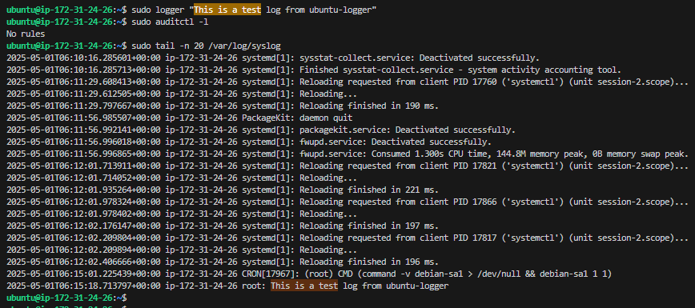

### 4. Configure remote forwarding

rsyslog was configured to forward events to the SIEM over TCP. In rsyslog syntax, `@@` specifies TCP and `@` specifies UDP.

```text
*.* @@<SIEM-PRIVATE-IP>:514
```

The service was restarted after the configuration change:

```bash
sudo systemctl restart rsyslog
```

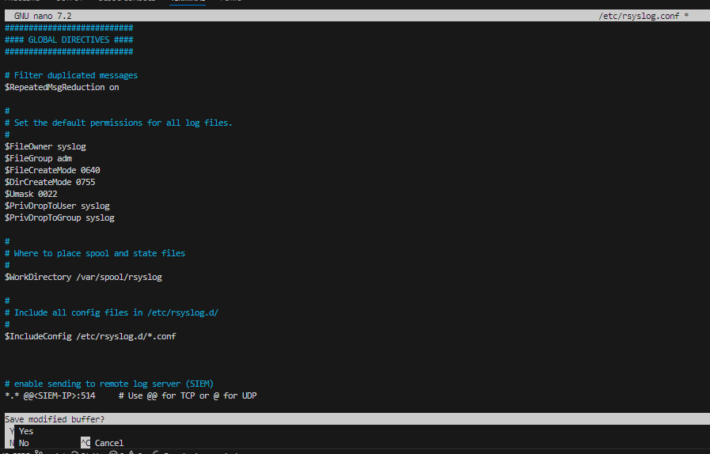

### 5. Install and enable Apache

Apache created the controlled web attack surface:

```bash
sudo apt install -y apache2
sudo systemctl enable --now apache2
curl http://localhost
```

The AWS security group allowed the required internal HTTP traffic for the exercise. Nmap later identified Apache 2.4.58 on TCP port 80.

## Phase 3 — ELK SIEM Server

### 1. Provision the SIEM instance

A third Ubuntu EC2 instance was dedicated to the ELK Stack.

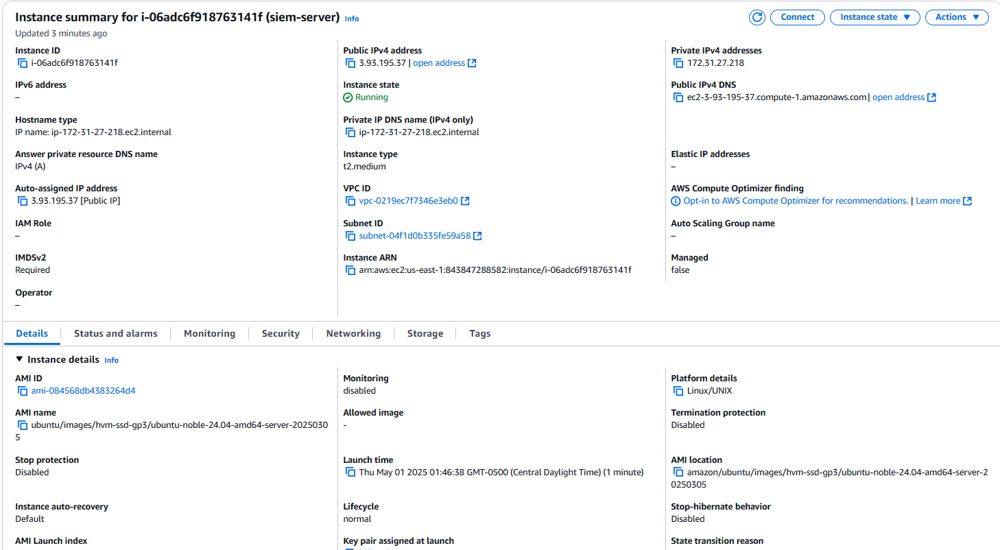

### 2. Install the runtime and Elastic components

The original lab installed Java and the Elasticsearch, Logstash, and Kibana packages from the Elastic package repository.

```bash
sudo apt update
sudo apt install -y openjdk-11-jdk
java -version
```

The historical project used the Elastic 7.x APT repository. A rebuilt environment should follow Elastic's current signed-repository instructions rather than copying deprecated `apt-key` commands.

### 3. Configure Elasticsearch

Elasticsearch was configured as a standalone, single-node lab cluster:

```yaml
network.host: 0.0.0.0
discovery.type: single-node
```

After restart, the local API response and TCP listener were checked:

```bash
sudo systemctl restart elasticsearch
curl http://localhost:9200
sudo netstat -tuln | grep 9200
```

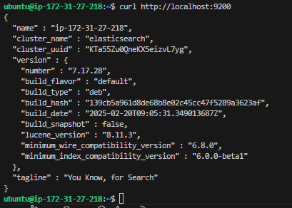

Binding to `0.0.0.0` was a lab configuration. Production Elastic services should use authentication, TLS, restricted interfaces, and tightly scoped firewall rules.

### 4. Configure Kibana

Kibana was enabled and started after its server binding was configured:

```yaml
server.host: "0.0.0.0"
```

```bash
sudo systemctl enable --now kibana
```

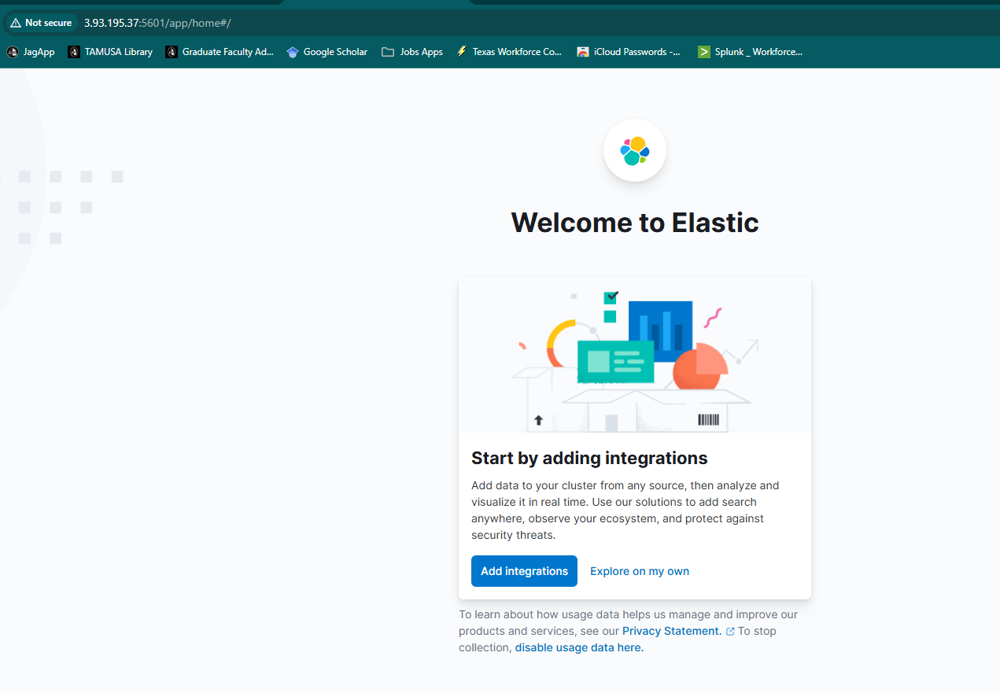

### 5. Configure Logstash ingestion

A Logstash pipeline was created under `/etc/logstash/conf.d/` to receive syslog events, process them, and send them to Elasticsearch.

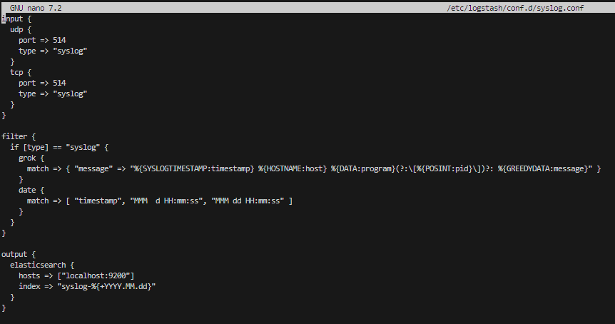

Logstash was then enabled and started:

```bash
sudo systemctl enable --now logstash
```

### 6. Connect the Ubuntu source to the SIEM

The Ubuntu logger's rsyslog destination was updated with the SIEM server's private address.

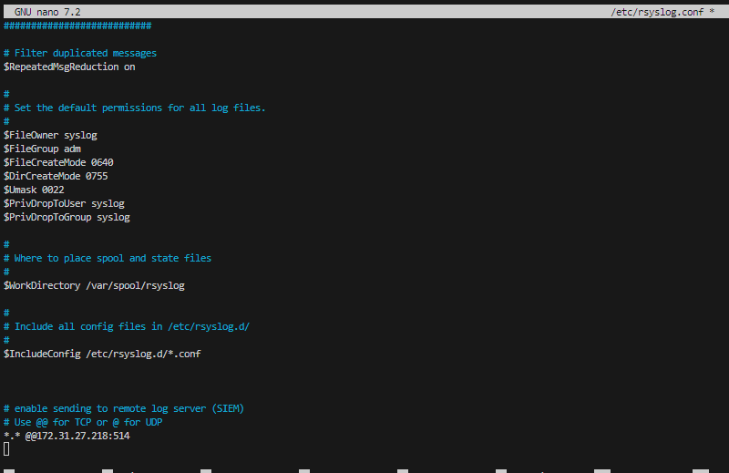

## Phase 4 — End-to-End Validation

### 1. Create the Kibana data view

A `syslog-*` data view was created in Kibana, using `@timestamp` as the time field.

### 2. Send a known test event

A test message was generated from the Ubuntu log source:

```bash
logger "Testing both port 514 and 5514 from Ubuntu logger"
```

### 3. Confirm ingestion

The event appeared in Kibana, confirming that the full telemetry pipeline worked before the Red Team exercise began.

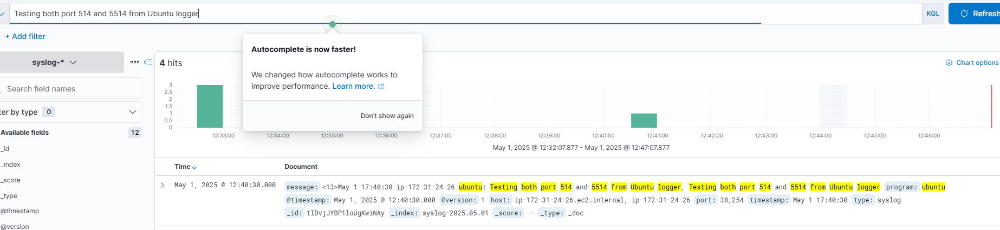

The validated path was:

```text
Ubuntu / Apache
      ↓
rsyslog over TCP
      ↓
Logstash
      ↓
Elasticsearch
      ↓
Kibana
```

## Phase 5 — Prepare for the Purple Team Exercise

After the pipeline was validated:

1. Nmap enumerated the controlled Ubuntu target.
2. Apache 2.4.58 was identified on TCP port 80.
3. Historical CVE request patterns were selected for controlled testing.
4. Encoded GET and POST requests were generated from Kali.
5. The patched Apache server rejected the requests.
6. Apache telemetry was forwarded to ELK.
7. Kibana queries isolated the requests for timeline, IOC, and ATT&CK analysis.

See:

- [Completed engagement](completed-engagement.md)
- [Attack scenario](attack-scenario.md)
- [Detection analysis](detection-analysis.md)
- [Architecture diagrams](architecture.md)
- [Validated KQL investigation](../detection-rules/kql/apache-path-traversal.kql)

## Security Improvements for a Rebuild

A current rebuild should improve the original educational configuration by:

- using private subnets for the target and SIEM;
- accessing administrative systems through AWS Systems Manager Session Manager or a tightly controlled bastion;
- limiting security-group rules to required sources and ports;
- keeping Elasticsearch and Kibana off the public internet;
- enabling TLS and authentication throughout the Elastic Stack;
- using current Elastic signing-key and package-repository procedures;
- protecting syslog in transit;
- enabling CloudTrail, VPC Flow Logs, and centralized AWS monitoring;
- using snapshots or infrastructure as code to make the environment reproducible;
- destroying temporary cloud resources after validation to prevent unnecessary cost.
