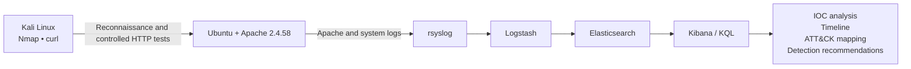
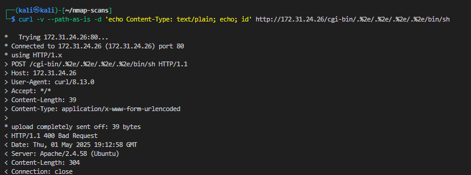

# AWS Purple Team Detection Project

A completed AWS-based Purple Team engagement that connected controlled offensive testing with centralized logging, SIEM investigation, IOC analysis, and MITRE ATT&CK mapping.

> **Status:** Completed — Spring 2025  
> **Course:** CSEC 5350, Intrusion Detection and Hacker Exploits  
> **Scope:** Authorized educational environment owned and controlled by the project author

## Executive Summary

This project deployed a three-system cybersecurity environment in AWS:

- **Red Team:** Kali Linux EC2 instance
- **Target / Log Source:** Ubuntu EC2 instance running Apache HTTP Server 2.4.58
- **Blue Team:** Ubuntu EC2 instance running Elasticsearch, Logstash, and Kibana

Nmap was used to enumerate the target and identify Apache on TCP port 80. Controlled requests modeled the path-traversal and remote-code-execution patterns associated with **CVE-2021-41773** and **CVE-2021-42013**.

The target was running a patched Apache release, so the requests were rejected rather than successfully exploited. This was an important verified result: the defensive pipeline still captured the malicious request patterns, HTTP methods, source activity, and HTTP 400 responses in Kibana. The exercise therefore demonstrated both effective patching and effective telemetry.

## Verified Results

| Test | Observed result | Defensive evidence |
| --- | --- | --- |
| Nmap service enumeration | Apache 2.4.58 identified on TCP/80 | Service and version established for attack-surface analysis |
| CVE-2021-41773 pattern | Encoded traversal request rejected | GET request recorded in Apache telemetry with HTTP 400 |
| CVE-2021-42013 pattern | Traversal/RCE-style POST rejected | POST to an encoded `/cgi-bin` path recorded with HTTP 400 |
| Log forwarding | Ubuntu and Apache events reached the SIEM | Events searchable through Elasticsearch and Kibana |
| SIEM investigation | Attack events isolated with KQL | URI patterns, methods, timestamps, source, and status codes correlated |
| ATT&CK analysis | Activity mapped to demonstrated behaviors | T1046, T1595.002, T1190, and conditional T1059 analysis |

## Architecture



Detailed diagrams are available in [docs/architecture.md](docs/architecture.md).

## Attack-to-Detection Workflow

1. Provisioned isolated AWS EC2 roles for the attacker, target/log source, and SIEM.
2. Installed and verified rsyslog and auditd on the Ubuntu log source.
3. Installed Elasticsearch, Logstash, and Kibana on the SIEM server.
4. Forwarded logs to the SIEM and validated ingestion using generated test messages.
5. Enumerated the target using Nmap SYN and service-version scanning.
6. Identified Apache 2.4.58 on TCP port 80.
7. Researched Apache path-traversal vulnerabilities and selected CVE-2021-41773 and CVE-2021-42013 for controlled simulation.
8. Sent encoded GET and POST requests from Kali.
9. Confirmed the patched server rejected both attempts.
10. Located the resulting Apache events in Kibana, created an IOC table and timeline, mapped observed behavior to ATT&CK, and documented mitigations.

## Investigation Queries

The completed investigation used searches based on the Apache log program and encoded traversal indicators:

```kql
message:("/cgi-bin" OR "%2e" OR "bin/sh")
AND program:("apache2" OR "apache_access")
```

```kql
program:"apache_access"
AND message:("/cgi-bin" OR "%2e" OR "bin/sh")
```

Reusable queries are stored under [detection-rules/kql/](detection-rules/kql/).

## Proof of Outcomes

### Patched server rejected the controlled request



### Kibana captured the malicious request pattern


Additional terminal and Kibana evidence is available in the [completed engagement record](docs/completed-engagement.md).

## Indicators Examined

- Source and destination roles
- GET and POST methods
- Encoded traversal sequences such as `%2e`
- Requests involving `/cgi-bin`
- Sensitive resource or shell strings
- `curl` user-agent activity
- HTTP 400 rejection responses
- Event timestamps defining the attack window

Sanitized examples are available in [iocs/sanitized-iocs.csv](iocs/sanitized-iocs.csv).

## MITRE ATT&CK Mapping

| Activity demonstrated | Technique |
| --- | --- |
| Network service enumeration | T1046 — Network Service Discovery |
| Active vulnerability scanning | T1595.002 — Vulnerability Scanning |
| Testing an exposed Apache service | T1190 — Exploit Public-Facing Application |
| Shell-oriented payload behavior | T1059 — Command and Scripting Interpreter, only as an attempted behavior because execution did not succeed |

Mappings distinguish between **attempted behavior** and **successful execution**. The evidence showed rejected requests and observable attack telemetry, not target compromise.

## Defensive Recommendations

- Maintain Apache patching and version auditing.
- Restrict security-group access to required sources and ports.
- Deploy AWS WAF or ModSecurity rules for encoded traversal patterns.
- Alert on repeated 400/403 responses involving `%2e`, `/cgi-bin`, `/bin/sh`, or `/etc/passwd`.
- Monitor unusual command-line user agents such as `curl` and `python-requests`.
- Forward Apache logs to centralized storage by default.
- Correlate reconnaissance followed by suspicious web requests.
- Enrich investigations with threat-intelligence context while prioritizing behavioral detection.

## Repository Contents

```text
.
├── README.md
├── docs/
│   ├── architecture.md
│   ├── attack-scenario.md
│   ├── completed-engagement.md
│   ├── detection-analysis.md
│   └── environment-build.md
├── detection-rules/
│   └── kql/
│       └── apache-path-traversal.kql
├── iocs/
│   └── sanitized-iocs.csv
├── diagrams/
├── screenshots/
└── scripts/
```

## Skills Demonstrated

AWS EC2 • VPC networking • Security Groups • Kali Linux • Ubuntu Linux • Apache • Nmap • curl • rsyslog • auditd • Logstash • Elasticsearch • Kibana • KQL • SIEM investigation • IOC analysis • CVE analysis • MITRE ATT&CK • Purple Team operations • Detection engineering • Technical documentation

## Key Takeaway

A prevented exploit can still produce valuable defensive evidence. In this engagement, patching stopped the tested Apache attack patterns, while centralized telemetry enabled the Blue Team to identify, correlate, and explain the attempted activity.

## Ethics and Safety

All testing was performed in an authorized educational environment. Do not scan, exploit, or test systems without explicit permission.
