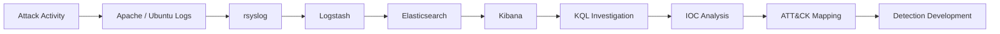
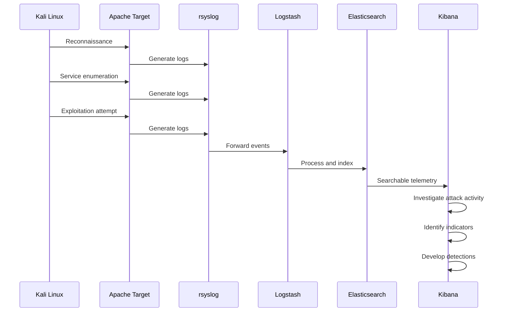
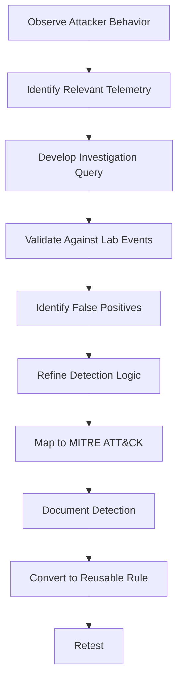

# Detection Analysis

## Overview

This document describes the defensive analysis performed during the AWS Purple Team Detection Lab.

Attack activity generated from the Kali Linux system was captured through target-system telemetry, forwarded through the ELK Stack, and analyzed in Kibana.

The primary objective was to determine whether simulated attacker behavior could be identified in collected logs and translated into useful detection opportunities.

---

## Detection Workflow



The workflow connected offensive activity directly to defensive analysis.

---

# 1. Data Collection

The Ubuntu target generated telemetry associated with reconnaissance and web exploitation activity.

Relevant sources included:

* Apache access logs
* Apache error logs
* Linux system logs
* Network-related events available within the lab

rsyslog was used to collect and forward telemetry into the centralized logging environment.

---

# 2. Log Processing

Logstash received events from the target environment and prepared them for indexing.

The pipeline followed:

```text
Ubuntu / Apache
      ↓
   rsyslog
      ↓
   Logstash
      ↓
Elasticsearch
```

Elasticsearch provided centralized indexing and storage so events could be searched and correlated during the investigation.

---

# 3. Kibana Investigation

Kibana served as the primary interface for investigating the collected telemetry.

The analysis focused on identifying events associated with known attack activity.

Investigation criteria included:

* Source IP address
* Destination service
* Event timestamps
* HTTP methods
* HTTP request paths
* Response codes
* Repeated requests
* Encoded characters
* Path traversal patterns
* Activity occurring during the known attack window

---

# 4. Establishing an Attack Timeline

A timeline helps correlate attacker actions with defensive telemetry.

The investigation followed the general sequence:



Exact timestamps and sanitized evidence can be added as the repository is expanded.

---

# 5. Reconnaissance Detection

Reconnaissance activity can create recognizable patterns when an attacker interacts with multiple ports or services.

Potential indicators include:

* Multiple connection attempts from one source
* Rapid service enumeration
* Sequential destination-port activity
* Requests occurring within a short time period
* Connections to services not normally accessed by the source

The effectiveness of detecting these behaviors depends on the telemetry available to the SIEM.

---

# 6. Web Exploitation Detection

The Apache exploitation scenario provides additional detection opportunities.

Analysis focused on suspicious web requests associated with path traversal and exploitation behavior.

Potential indicators include:

* Traversal sequences
* Encoded traversal characters
* Requests for unusual filesystem paths
* Abnormal URI structures
* Repeated suspicious requests
* HTTP activity inconsistent with normal application use

These behaviors can provide stronger detection logic than relying exclusively on a source IP address.

---

# 7. KQL Investigation

Kibana Query Language (KQL) was used to filter and investigate events.

Because Elasticsearch field names depend on the Logstash pipeline and mappings used in the environment, detection queries should be validated against the actual indexed fields before deployment.

Example investigation concepts include filtering for:

```text
source.ip
http.request.method
url.path
http.response.status_code
@timestamp
```

The exact field names used by this lab should be documented from the Elasticsearch index mapping.

---

# 8. Detection Strategy

The project uses multiple levels of detection logic.

## Level 1 — Indicator-Based Detection

Detect known indicators such as:

* Known source address
* Known suspicious URI
* Known exploitation string

These detections are useful during an active investigation but may have limited long-term value because indicators can change.

## Level 2 — Pattern-Based Detection

Detect suspicious characteristics such as:

* Traversal sequences
* Encoded traversal attempts
* Abnormal URI structures
* Repeated suspicious requests

Pattern-based detections are generally more resilient than matching a single IOC.

## Level 3 — Behavior-Based Detection

Detect combinations of attacker behavior, such as:

```text
Reconnaissance
      ↓
Web enumeration
      ↓
Suspicious HTTP requests
      ↓
Exploitation behavior
```

Behavior-based detection provides additional context and can reduce dependence on individual indicators.

---

# 9. IOC Analysis

Indicators identified during the exercise can be categorized as:

| IOC Category    | Example Use                      |
| --------------- | -------------------------------- |
| IP Address      | Identify observed attack source  |
| URI             | Identify suspicious requests     |
| Timestamp       | Reconstruct attack chronology    |
| HTTP Method     | Understand request behavior      |
| HTTP Status     | Evaluate server response         |
| User Agent      | Identify unusual client behavior |
| Request Pattern | Identify exploitation attempts   |

Public IOC examples should be sanitized where appropriate.

---

# 10. MITRE ATT&CK Mapping

Detection development should map to behaviors actually demonstrated by the collected evidence.

Potential mappings include:

| Observed Behavior                                  | ATT&CK Technique                          |
| -------------------------------------------------- | ----------------------------------------- |
| Network service enumeration                        | T1046 — Network Service Discovery         |
| Exploitation of exposed Apache service             | T1190 — Exploit Public-Facing Application |
| Command execution through a shell, if demonstrated | T1059 — Command and Scripting Interpreter |

A technique should only be included when supporting evidence exists within the lab.

---

# 11. Detection Engineering Process

The project follows a repeatable detection-development lifecycle:



This process allows attack simulations to directly improve defensive monitoring.

---

# 12. Detection Validation

A detection should not be considered complete simply because a query returns the expected attack event.

Validation should evaluate:

* Does the query detect the simulated activity?
* Does normal traffic also trigger the query?
* Which fields provide the strongest detection signal?
* Can the attacker easily modify the indicator?
* Can the rule be generalized to detect behavior?
* Are additional data sources required?
* What false positives are expected?

This turns a search query into a more defensible detection.

---

# 13. Future Detection Development

Future versions of the lab can expand detection coverage through:

* KQL detection queries
* Sigma rules
* Additional Apache attack scenarios
* Network telemetry
* Suricata alerts
* Zeek network metadata
* Endpoint telemetry
* Detection validation scripts
* Automated ATT&CK mapping
* Detection-as-code workflows

Reusable detection content will be stored under:

```text
detection-rules/
├── kql/
└── sigma/
```

---

# Key Takeaway

The primary defensive lesson from this exercise is that successful detection requires more than identifying a malicious IP address.

The stronger workflow is:

**Understand attacker behavior → identify observable telemetry → investigate the evidence → develop behavioral detection logic → validate the detection.**

This Purple Team process connects offensive security testing directly to measurable improvements in defensive visibility.
